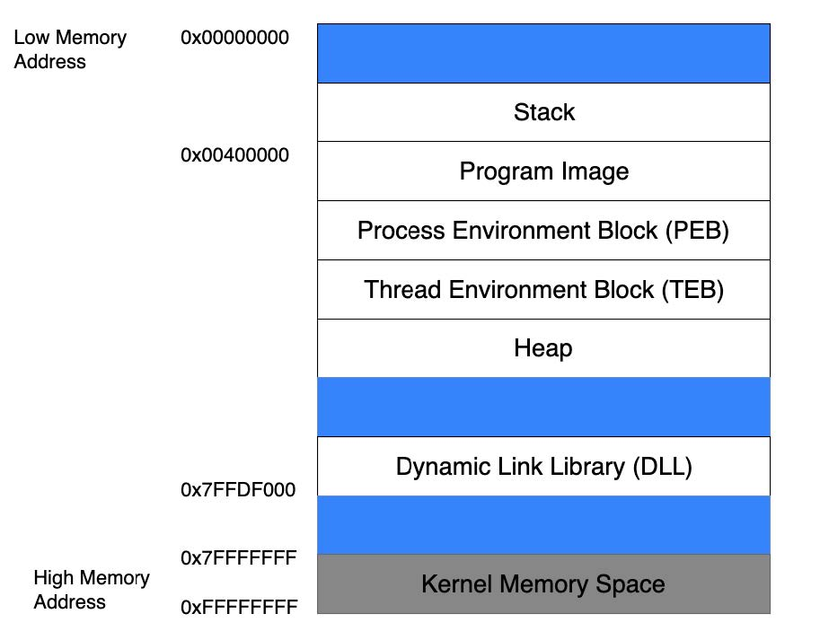
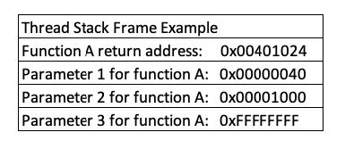
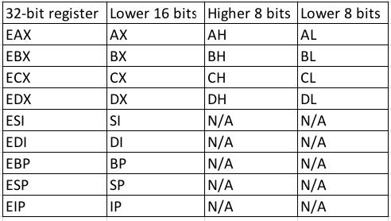
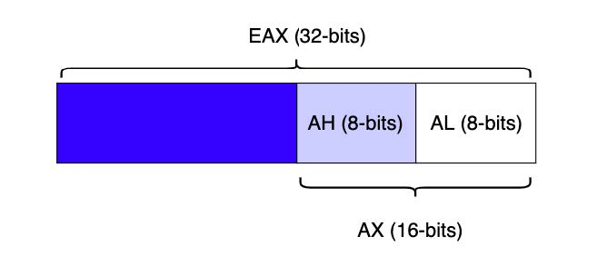

# Buffer Overflows

## Introduction to the x86 Architecture

### 0x00 Stack

**Stack**

1. a short-term data area for functions, local variables, and program control information, each thread in a running application has its own stack
2. LIFO, Last-In First-Out

### 0x01 Heap

1. long-term and more dynamic data storage area

### 0x02 Function Return Mechanics

### 0x03 CPU Registers

- EAX (accumulator): Arithmetical and logical instructions
- EBX (base): Base pointer for memory addresses
- ECX (counter): Loop, shift, and rotation counter
- EDX (data): I/O port addressing, multiplication, and division
- ESI (source index): Pointer addressing of data and source in string copy operations
- EDI (destination index): Pointer addressing of data and destination in string copy operations
- ESP Extended Stack Pointer, top
- EBP Extended Base Pointer, base
- EIP instruction pointer, point to the next code to be executed

### 0x04 Buffer Overflow Walkthrough

pass

### 0x05 overflow the buffer

pass

## 0x06 Windows buffer overflows

1. Discovering the vulnerability

    - source code review
    - reverse engineering
    - fuzzing

2. Fuzzing the http protocol

debugger and fuzzing script, [SOCP P379]

3. Win32 Buffer Overflow Exploitation

protection mechanisms:
   - DEP, Data Execution Prevention
   - ASLR, Address Space Layout Randomization
   - CFG, Control Flow Guard

4. Controlling EIP

   - find EIP, bin search / special string(msf-pattern_create, msf-pattern_offset)

5. Locating Space for our shellcode

pass

6. checking for bad characters

因为payload传输的协议限制, 一些特殊的字节不易出现在payload内

例如, 如果payload通过http协议传输, 则 0x00, 0x0A, 0x0D, 0x25, 0x26, 0x2B, 0x3D等字符宜出现在payload

7. Redirecting the Execution Flow
   
- indirect jump 
> the address used in the library must be static, which eliminates libraries compiled with ASLR support
> the address of the instruction must not contain any of the bad characters that would break the exploit

此前, 已经可以控制 EIP, 并可以将shellcode 写入到可通过ESP访问的内存中, 那么可以将EIP指向内存中任意一个 `JMP ESP`的位置

可以通过使用 (mona)[https://github.com/corelan/mona] 对要利用的软件进行特定搜索, 可用于 `Immunity debugger` 和 `windbg`

- `!mona modules` 从中找一个地址范围不含坏字符且没开内存保护的module(若含坏字符, 则无法将地址写到EIP)
- 使用 `msf-nasm_shell`, 得到 `jmp esp` 的机器码为 `0xFFE4`
- `!mona find -s "\xff\xe4" -m "module_name"`,找到module 中的 `\xff\xe4`
- 生成 shellcode, 如果shellcode中含有坏字符, 则需要对shellcode进行编码, 比如 msfvenom的 x86/shikata_ga_nai 编码器
- 将shellcode 写到 esp

这里在将 EIP指向 `jmp esp` 的时候, 因为python3自行加了 `\xc2` 导致一直失败, 换用 python2后不再有问题

*note*
> 本人在复现时, 无论是 x86 还是 x64 的payload均失败, 即使shellcode通过shell loader加载执行没问题
> 复现耗时过长, 先行跳过, 后续姿势提升了再做尝试

## 0x07 Linux Buffer Overflows

跟windows端的很相似, pass
