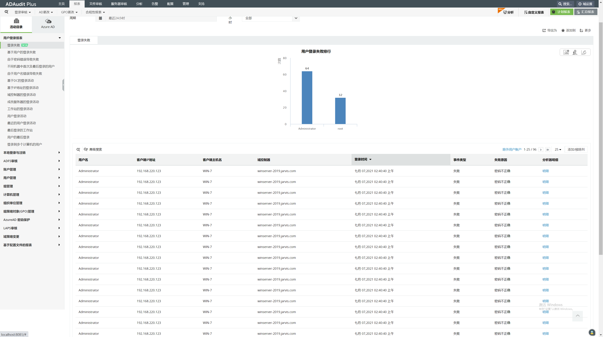

# WinBrute

这是一个 `delphi` 编写的 windows 本地爆破工具, 可用于本地账号爆破和域账号爆破. 一般用于在低权限时的提权

[项目地址](https://github.com/stascorp/WinBrute)

## 0x00 总结

1. 本工具为俄罗斯黑阔写的本地爆破工具
2. 工具会将账号和域名通过简单组合加入到爆破字典
3. 工具会将账号和域名简单组合后, 转为俄语加入到爆破字典
4. 密码字典中, 如果有 '%username%', 会被替换为程序输入 <user>
4. 工具会起处理器线程数相同的线程进行爆破, 据本地虚拟机测试, 分到 3700x 4线程的win7虚拟机可开4线程, 爆破速度在 150r/s
5. 工具使用 `delphi` 原生的登录函数 `LogonUser` 进行爆破
5. 域账号爆破时, 使用的协议为 kerberos, 流量侧和终端侧均可以进行爆破检测
6. 本地账号爆破, 受本人能力所限, 尚不清楚如何进行验证 [ToDo: WinBrute 本地爆破认证方式]

## 0x01 源码分析

### 1. 输入输出

> USAGE: WinBrute.exe <wordlist> <user> [domain] [outfile]

- `<worldlist>` 密码字典, required
- `<user>` 要爆破的账号, required
- `[domain]` 账号所在域, optional
- `[outfile]` 结果写到文件, optional

由此可见, 此工具支持本地账号与域账号的爆破

### 2. 主流程

1. 读取密码字典

```pascal
S := TStringList.Create;
S.LoadFromFile(ParamStr(1));
```

2. 字典扩展

```pascal
S.Text := StringReplace(S.Text, '%username%', user, [rfReplaceAll]);    // 将密码字典中的 %username% 替换为调用时输入的 <user>

S.Insert(0, '');    // 密码为空的情况

// 简单组合 <user> 放入字典
S.Insert(0, user);
S.Insert(0, user+user);
S.Insert(0, user+user+user);

// <user> 简单组合后, 转为俄语加入字典
S.Insert(0, TranslitRu(user));
S.Insert(0, TranslitRu(user+user));
S.Insert(0, TranslitRu(user+user+user))

// <user> [domain] 的原型, 大写, 小写的场景分别英文, 俄语的形式加入俄语字典,  36

if Length(user) > 3 then
    begin
      S.Insert(0, user[1] + user[Length(user)-1] + user[Length(user)]);
      S.Insert(0, LowerCase(user[1] + user[Length(user)-1] + user[Length(user)]));
      S.Insert(0, UpperCase(user[1] + user[Length(user)-1] + user[Length(user)]));
    end;
    
// 如果 user 长度大于3, 又是一顿胡乱拼凑...
```

3. 起线程, 爆破

```pascal
SetLength(Threads, SI.dwNumberOfProcessors);
for I := 0 to Length(Threads) - 1 do begin
    Threads[I] := Thr.Create(True);
    Threads[I].FreeOnTerminate := True;
    Threads[I].ShortPause := False;
    Threads[I].slp := 0;
end;
for I := 0 to Length(Threads) - 1 do
  Threads[I].Start;
  
```

4. 爆破细节

```pascal
b := LogonUser(PWideChar(user), PWideChar(domain), PWideChar(pass), LOGON32_LOGON_NETWORK, LOGON32_PROVIDER_DEFAULT, hToken)
```

登录状态为以下几种情况, 则被视为爆破成功:

- ERROR_ACCOUNT_RESTRICTION, // Blank password or sign-in time limitation
- ERROR_PASSWORD_EXPIRED, // Password expired
- ERROR_ACCOUNT_DISABLED, // Account disabled
- ERROR_ACCOUNT_EXPIRED, // Account expired
- ERROR_PASSWORD_MUST_CHANGE: // User must change password

如果主机关机 `ERROR_NO_LOGON_SERVERS`, 或账号被锁定 `ERROR_ACCOUNT_LOCKED_OUT`, 则sleep 5000ms:

## 0x02 爆破特征

### 1. 流量

域爆破时, 抓包 得到 kerberos 相关的流量记录

[pcap of WinBrute](assets/WinBrute/winbrute_kerb.pcap)


### 2. 终端日志




### 3. 爆破时的进程信息 (Process Monitor)

[Process Monitor](assets/WinBrute/WinBrute.PML)

## 0x03 代码改进

改进点很少, 有:

- 简单的用户名, 域名拼接并不需要, 反而成为工具的特征
- 用户名, 域名转为俄语进行爆破, 也是比较明显的工具特征

改进后的项目地址: [w-devin/WinBrute](https://github.com/w-devin/WinBrute)
