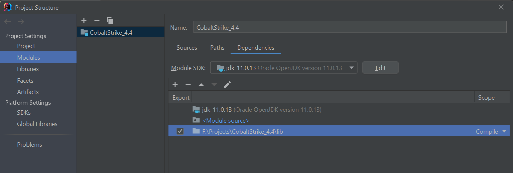
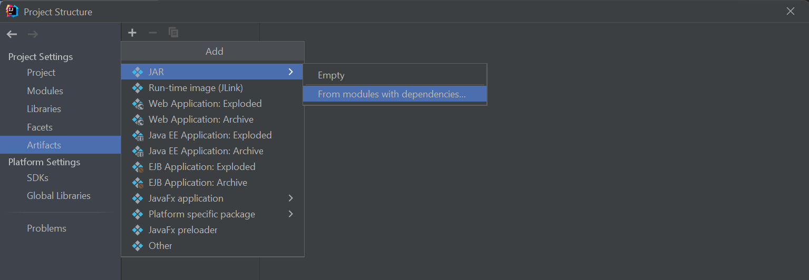
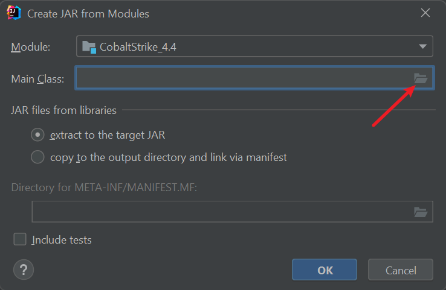
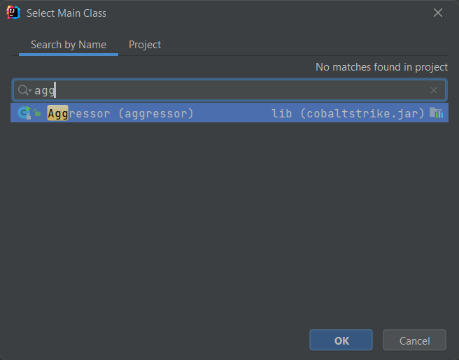
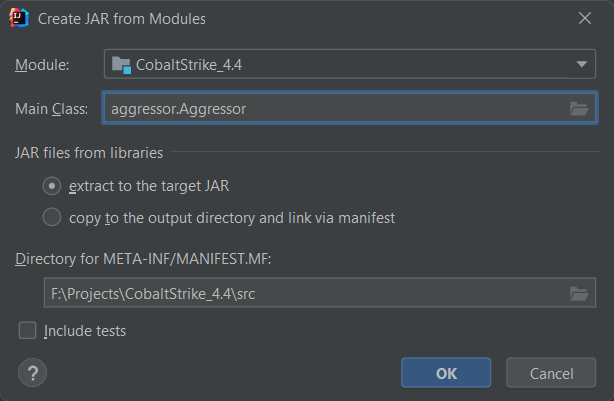
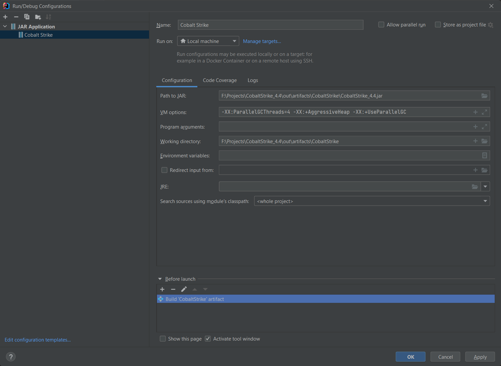
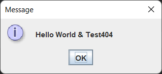

# Cobalt Strike 二次开发环境准备

## 准备

1. IDEA
2. Java, 版本 `1.8`, 实际根据要二开的jar包的构建版本来, 文章截图, 用了 `11.0.13`, 有问题, 后面才切了 `1.8`
3. cobaltstrike.jar, 这里用了 `4.4` 版本, md5: `222b8f27dbdfba8ddd559eeca27ea648`
4. TeamServer 最好在linux环境下运行, 所以准备好一个linux

## 项目创建

1. 新建一个空的java项目
2. 新建一个 `lib` 目录, 并把 `cobaltstrike.jar` 复制到该目录
3. `File` -> `Project Structure` -> `Project Settings` -> `Modules` -> `Dependencies` -> `➕` -> `JARs or Directories...`, 
4. 选择select `lib` path, 然后点击 `apply`

5. 添加 `Artifacts`

6. 点这个选择按钮



7. 输入并选择 `Aggressor`, `Aggressor` 类是 cs 的入口



8. `apply` -> `ok`

到此项目就创建完毕了

## 魔改

在创建的`lib`目录, 双击想要反编译的 .jar 文件即可查看源码, 若想对其进行魔改并编译, 只要把代码复制到src目录下一个文件名相同的java文件即可

目录结构最好保持一致

因为 IDEA 没有直接复制java的功能, 所以需要复制代码文本, 显得有些low, 所以比较推荐把jar包反编译的源码放到某个目录,  方便源码阅读和复制

### 反编译源码

1. 获取反编译工具, 这里直接使用 IDEA内置的 decompiler

Macos
> /Applications/IntelliJ IDEA.app/Contents/plugins/java-decompiler/lib/java-decompiler.jar

Windows
> C:\Program Files\JetBrains\IntelliJ IDEA 2021.3\plugins\java-decompiler\lib\java-decompiler.jar


2. 反编译

```bash
java -cp java-decompiler.jar org.jetbrains.java.decompiler.main.decompiler.ConsoleDecompiler -dgs=true path_to/cobaltstrike.jar dst_path/
```

3. 反编译后, 会在目的目录获得一个 jar 文件, 文件解压后即可获得java源码, 解压前最好把项目目录添加到杀软白名单

4. 此时项目的目录结构为
```bash
CobaltStrike_4.4/
├── CobaltStrike_4.4_src
│   ├── aggressor
│   ├── beacon
│   ├── c2profile
│   ├── cloudstrike
│   ├── com
│   ├── common
│   ├── console
│   ├── ...
│   └── ui
├── lib
│   └── cobaltstrike.jar
└── src
    └── META-INF
```

### coding, build and run

cs client 的入口方法为: `aggressor.Aggressor#main`, 可以在其显示登录界面前弹个消息窗口测试一下

1. 右键cs的入口类文件 `aggressor/Aggressor.java`, `Refactor` -> `Copy File` 复制文件到 `src` 目录下的相同路径

```bash
$ tree CobaltStrike_4.4/ -L 2
CobaltStrike_4.4/
├── CobaltStrike_4.4.iml
├── CobaltStrike_4.4_src
│   ├── aggressor
│   ├── beacon
│   ├── c2profile
│   ├── cloudstrike
│   ├── cobaltstrike.jar
│   ├── com
│   ├── common
│   ├── console
│   ├── cortana
│   ├── data
│   ├── ...
│   └── ui
├── lib
│   └── cobaltstrike.jar
└── src
    ├── aggressor
    │   └── Aggressor.java
    └── META-INF
        └── MANIFEST.MF
```

然后在入口main方法添加一行:

```java
JOptionPane.showMessageDialog(null, "Hello World & Test404");
```

2. build 项目

`Build` -> `Build Artifacts` -> `build`

编译完成后, 会在 项目根目录下生成一个`out` 文件夹, 里面有编译出来的jar包

3. 添加 Client 的运行参数

`Add Configuration` -> `➕` -> `JAR Application`



一些配置参考了cs启动脚本, 直接抄作业即可

4. 点击run, 即可正常运行



5. 但是会有认证问题, 下一章处理认证问题


## Reference

1. [IntelliJ-IDEA修改cobaltstrike](https://pingmaoer.github.io/2020/06/08/IntelliJ-IDEA%E4%BF%AE%E6%94%B9cobaltstrike/)
2. [CobaltStrike二次开发](https://lengjibo.github.io/CobaltStrikeCode/)